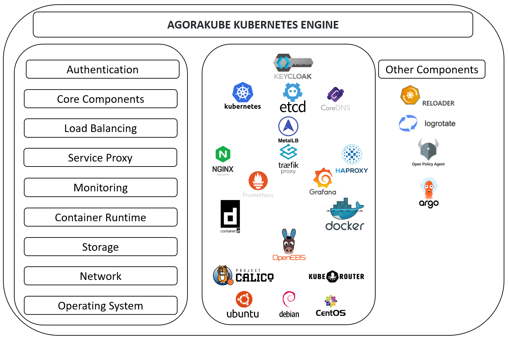

# AGORAKUBE KUBERNETES ENGINE
<!-- ALL-CONTRIBUTORS-BADGE:START - Do not remove or modify this section -->

<!-- ALL-CONTRIBUTORS-BADGE:END -->
<!-- ALL-CONTRIBUTORS-BADGE:START - Do not remove or modify this section -->

<!-- ALL-CONTRIBUTORS-BADGE:END -->

This project is aimed to provide the simplest way to install kubernetes on AMD-64 bare-metal, virtual & Cloud environments.
Currently, Ubuntu 18.04 & 20.04,  Centos 7 and Debian 10  are supported, but several other operating systems will be available soon.

Master branch is stable.

## Table of Contents

This is a list of points that will be explained in this Readme file for the Agorakube project :

- [What is AGORAKUBE](#what-is-agorakube)
- [How to install](#how-to-install)
- [How to give feedback](#how-to-give-feedback)
- [How to contribute](#how-to-contribute)
- [Community](#community)
- [Licensing](#licensing)

## What is AGORAKUBE

Agorakube is an easy-to-use, stable Kubernetes distribution (Kubernetes v1.15, 1.16, 1.17, 1.18, 1.19, 1.20, 1.21).

By its symplicity, AGORAKUBE provide a good way to deploy and manage K8S Clusters.

Agorakube is based on Ansible scripts that install and configure Kubernetes components (control plane and data plane) quickly on bare-metal / VMs / Cloud Instances, as systemd services.

This distribution is also adaptive by offering the opportunity to customize your deployment and fit to your needs : 
* OS : Ubuntu-18.04/20.04-amd64 and Centos 7.X-amd64, Debian-10-amd64 
* DNS Service: CoreDNS
* Ingress Controller Traefik v2 & HA-Proxy & Nginx (Default)
* Container Runtime: Containerd (Default) & Docker
* Certificats: Self Signed PKI using OpenSSL
* Storage: OpenEBS (Jiva and HostPath)
* Monitoring: Prometheus/Grafana/node-Exporter
* CNI plugin: Kube-router, Calico (VxLAN Cross-Subnet)
* MetalLB (L2/ARP mode for external LB)
* Metrics-Server
* Kubernetes-Dashboard
* Kubernetes ConfigMap and Secret Reloader
* Logrotate
* OIDC/SSO with Keycloak

This project is currently under active development so other customizable options will be added soon.

## How to install

To deploy your K8S cluster follow these [instructions](docs/instructions.md).

## How to give feedback

Every feedback is very welcome via the
[GitHub site](https://github.com/ilkilabs/agorakube)
as issues or pull (merge) requests.

You can also give use vulnerability reports by this way.
## How to contribute

See our [Code Of Conduct](https://github.com/ilkilabs/agorakube/blob/master/CODE_OF_CONDUCT.md) and [CONTRIBUTING](https://github.com/ilkilabs/agorakube/blob/master/docs/CONTRIBUTING.md) for more information.

## Community

Join Agorakube's community for discussion and ask questions : [AGORAKUBE's Slack](http://slack.agorakube.ilkilabs.io/)

Channels :
- **#general** - For general purpose (news, events...)
- **#developpers** - For people who contribute to Agorakube by developing features
- **#end-users** - For end users who want to give us feedbacks
- **#random** - As its name suggests, for random discussions :)

## Licensing

All material here is released under the [APACHE 2.0 license](./LICENSE).
All material that is not executable, including all text when not executed,
is also released under the APACHE 2.0.
In SPDX terms, everything here is licensed under APACHE 2.0;
if it's not executable, including the text when extracted from code, it's
"(APACHE 2.0)".

Lagorakube almost all software today, this software depends on many
other components with their own licenses.
Not all components we depend on are APACHE 2.0-licensed, but all
*required* components are FLOSS. We prevent licensing issues
using various processes (see [CONTRIBUTING](./docs/CONTRIBUTING.md)).

## Contributors ✨

Thanks goes to these wonderful people ([emoji key](https://allcontributors.org/docs/en/emoji-key)):
<!-- ALL-CONTRIBUTORS-LIST:START - Do not remove or modify this section -->
<!-- prettier-ignore-start -->
<!-- markdownlint-disable -->
<table>
  <tr>
    <td align="center"><a href="https://github.com/pranavbaitule"> <b>pranavbaitule</b></a> <a href="https://github.com/ilkilab/agorakube/commits?author=pranavbaitule" title="Documentation">📖</a></td>
  </tr>
</table>

<!-- markdownlint-restore -->
<!-- prettier-ignore-end -->

<!-- ALL-CONTRIBUTORS-LIST:END -->

<!-- ALL-CONTRIBUTORS-LIST:START - Do not remove or modify this section -->
<!-- prettier-ignore-start -->
<!-- markdownlint-disable -->
<table>
  <tr>
    <td align="center"><a href="https://www.ilki.fr/"> <b>pierre villard</b></a> <a href="#projectManagement-pierreilki" title="Project Management">📆</a> <a href="https://github.com/ilkilabs/agorakube/commits?author=pierreilki" title="Code">💻</a> <a href="#mentoring-pierreilki" title="Mentoring">🧑‍🏫</a> <a href="https://github.com/ilkilabs/agorakube/commits?author=pierreilki" title="Documentation">📖</a></td>
    <td align="center"><a href="https://github.com/bryanILKI"> <b>bryanILKI</b></a> <a href="https://github.com/ilkilabs/agorakube/commits?author=bryanILKI" title="Code">💻</a> <a href="#maintenance-bryanILKI" title="Maintenance">🚧</a> <a href="https://github.com/ilkilabs/agorakube/commits?author=bryanILKI" title="Documentation">📖</a></td>
    <td align="center"><a href="https://github.com/sabrine-hammami"> <b>sabrine-hammami</b></a> <a href="https://github.com/ilkilabs/agorakube/commits?author=sabrine-hammami" title="Code">💻</a> <a href="#maintenance-sabrine-hammami" title="Maintenance">🚧</a> <a href="https://github.com/ilkilabs/agorakube/commits?author=sabrine-hammami" title="Documentation">📖</a></td>
    <td align="center"><a href="https://github.com/ur2p0"> <b>Adrien Huerre</b></a> <a href="https://github.com/ilkilabs/agorakube/commits?author=ur2p0" title="Documentation">📖</a> <a href="#content-ur2p0" title="Content">🖋</a> <a href="#projectManagement-ur2p0" title="Project Management">📆</a></td>
    <td align="center"><a href="https://github.com/gaelfr29"> <b>gaelfr29</b></a> <a href="#business-gaelfr29" title="Business development">💼</a> <a href="#projectManagement-gaelfr29" title="Project Management">📆</a></td>
    <td align="center"><a href="http://aaronjohnson.io"> <b>Aaron Johnson</b></a> <a href="https://github.com/ilkilabs/agorakube/commits?author=acjohnson" title="Code">💻</a> <a href="https://github.com/ilkilabs/agorakube/commits?author=acjohnson" title="Documentation">📖</a></td>
    <td align="center"><a href="http://hameedullah.com"> <b>Hameedullah Khan</b></a> <a href="https://github.com/ilkilabs/agorakube/commits?author=hameedullah" title="Code">💻</a> <a href="https://github.com/ilkilabs/agorakube/commits?author=hameedullah" title="Documentation">📖</a></td>
  </tr>
  <tr>
    <td align="center"><a href="https://github.com/Flybro"> <b>Big Bill</b></a> <a href="https://github.com/ilkilabs/agorakube/commits?author=Flybro" title="Code">💻</a> <a href="https://github.com/ilkilabs/agorakube/commits?author=Flybro" title="Documentation">📖</a></td>
    <td align="center"><a href="https://github.com/husseinfahmy"> <b>Hussein Fahmy</b></a> <a href="https://github.com/ilkilabs/agorakube/commits?author=husseinfahmy" title="Code">💻</a></td>
    <td align="center"><a href="https://github.com/rushilgala"> <b>rushilgala</b></a> <a href="https://github.com/ilkilabs/agorakube/commits?author=rushilgala" title="Code">💻</a></td>
    <td align="center"><a href="https://github.com/tyb3n"> <b>tyb3n</b></a> <a href="https://github.com/ilkilabs/agorakube/commits?author=tyb3n" title="Documentation">📖</a></td>
    <td align="center"><a href="https://ericstumbo.tech"> <b>Eric Stumbo</b></a> <a href="https://github.com/ilkilabs/agorakube/commits?author=digikin" title="Code">💻</a></td>
    <td align="center"><a href="https://github.com/msouvatdy"> <b>msouvatdy</b></a> <a href="https://github.com/ilkilabs/agorakube/commits?author=msouvatdy" title="Code">💻</a> <a href="https://github.com/ilkilabs/agorakube/commits?author=msouvatdy" title="Documentation">📖</a></td>
  </tr>
</table>

<!-- markdownlint-restore -->
<!-- prettier-ignore-end -->

<!-- ALL-CONTRIBUTORS-LIST:END -->

This project follows the [all-contributors](https://github.com/all-contributors/all-contributors) specification. Contributions of any kind welcome!
