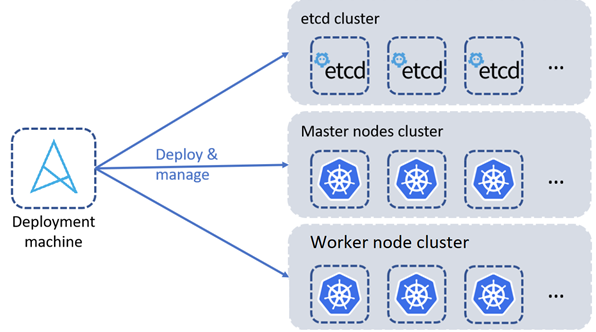

# Table of Contents
This is a list of points that will be explained in this instructions file for the AGORAKUBE project :

- [High-level Architecture](#high-level-architecture)
- [Prerequisites](#prerequisites)
- [Nodes Setup](#nodes-setup)
- [K8S Cluster Configuration](#k8s-cluster-configuration)
- [AGORAKUBE Parameters](#agorakube-parameters)
- [Kubernetes deployment](#kubernetes-deployment)
- [Manage ETCD Cluster](./manage_etcd.md)
- [Create Pod](#create-pod)
- [Storage Benchmark](#storage-benchmark)
- [Upgrade OpenEBS Storage](#upgrade-openEBS-storage)
- [How to use Reloader](#how-to-use-reloader)
- [AGORAKUBE Log Architecture](#agorakube-log-architecture)
- [Upgrade And Downgrade Kubernetes with Agorakube](#upgrade-and-downgrade-kubernetes-with-Agorakube)
- [Uninstall AGORAKUBE](#uninstall-agorakube)


# High-level Architecture

Below a diagram of the high-level architecture deployed by AGORAKUBE :


**Notes :** This distibution is aimed to be customizable so you can choose : 
 - Where the **etcd** will be deployed (with the master or not) 
 - The number of **master** nodes to deploy (from 1 to many - 5 nodes for production)
 - The number of **etcd** nodes to deploy (from 1 to many - 5 nodes for production)
 - The number of **worker** nodes to deploy (from 1 to many)
 - The number of **storage** nodes to deploy (from 0 to many - 3 nodes for production needs)
 
 # Prerequisites

This section explains what are the prerequisites to install AGORAKUBE in your environment.

## OS

Below the OS currently supported on all the machines :
  - Ubuntu 18.04 & 20.04 - amd64
  - Centos 7 - amd64
  - Debian 10 - amd64

## Network

- Full network connectivity between all machines in the cluster (public or private network is fine)
- Full internet access
- Unique hostname, MAC address, and product_uuid for every node. See here for more [details](https://kubernetes.io/docs/setup/production-environment/tools/kubeadm/install-kubeadm/#verify-the-mac-address-and-product-uuid-are-unique-for-every-node).
- Certain ports are open on your machines. See here for more [details](https://kubernetes.io/docs/setup/production-environment/tools/kubeadm/install-kubeadm/#check-required-ports).

If Agorakube is installed behind a Proxy/Firewall, make sure the following URLs are accessible:
-	https://pypi.org/
-	https://pypi.python.org/
-	https://files.pythonhosted.org
-	https://storage.googleapis.com/kubernetes-release/
-	https://github.com/etcd-io/etcd/releases/download/
-	https://dl.k8s.io/
-	https://github.com/containernetworking/plugins/releases/download/
-	https://download.docker.com/linux/
-	https://index.docker.io/v1/
-	https://k8s.gcr.io/
-	https://docker.io
-	https://github-releases.githubusercontent.com/


## Node Sizing

Node sizing indicated here is for production environment. You can custom it according to suit your needs.

It is a best-practice to install ETCD and MASTERS on separate hosts.

| AGORAKUBE Type | no HA or all-in-one | no-production | production |
| --- | --- | --- | --- |
| MASTER | 1 | 2 | 3+ |
| ETCD | 1 | 3 | 5 |
| WORKER | 1 | X | X |
| STORAGE | 0 - 1 | 3 | 3+ |

We actually configure the proper VM size for your MASTER depending on the number of nodes (Workers + Storage) in your cluster

| nodes | Master Size |
| --- | --- |
| 1-5 | 1 CPU - 3,75 Go RAM |
| 6-10 | 2 CPU - 7,50 Go RAM |
| 11-100 | 4 CPU - 15 Go RAM |
| 101-250 | 8 CPU - 30 Go RAM |
| 251-500 | 16 CPU - 60 Go RAM |
| more than 500 | 32 CPU - 120 Go RAM |

We actually configure the proper VM size for your ETCD depending on the number of nodes (Workers + Storage + Masters) in your cluster

| nodes | ETCD Size | Notes |
| --- | --- | --- |
| 0-50 | 2 CPU - 8 Go RAM | A small cluster serves fewer than 100 clients, fewer than 200 of requests per second, and stores no more than 100MB of data |
| 50-250 | 4 CPU - 16 Go RAM | A medium cluster serves fewer than 500 clients, fewer than 1,000 of requests per second, and stores no more than 500MB of data |
| 250-1000 | 8 CPU - 32 Go RAM | A large cluster serves fewer than 1,500 clients, fewer than 10,000 of requests per second, and stores no more than 1GB of data |
| 1000-3000 | 16 CPU - 64 Go RAM | An xLarge cluster serves more than 1,500 clients, more than 10,000 of requests per second, and stores more than 1GB data |

# Nodes Setup

This section explains how to setup nodes before deploying Kubernetes Clusters with AGORAKUBE.

## Deployment node

The deployment node is an Ansible server which contains all Ansible roles and variables used to deploy and configure Kubernetes Clusters with AGORAKUBE distribution.

The prerequisites are:
- SSH Server (like openssh-server)
- Python3 & pip3
- git
- curl
- with pip3 : ansible, netaddr

Then clone or download the AGORAKUBE git branch / release you want to use.

You can run the following command to automatically install those packages and clone the latest stable AGORAKUBE distribution:
```
bash <(curl -s https://raw.githubusercontent.com/ilkilab/agorakube/master/setup-deploy.sh)
```

### Use Python Virtual Environment

Sometimes it is better to run Ansible and all its dependences into a specific *Python Virtual Environment*. This will make it easier for you to install Ansible and all its dependences needed by AGORAKUBE without take the risk to break your existing Python/Python3 installation.


You can create your own *Python Virtual Environment* from scratch by following:

```
# Install on deploy machine python3, pyhton3-pip and python3-venv
# On Ubuntu (18.04,20.04) or Debian10 use the following commands:
apt update
apt install -yqq python3 python3-pip python3-venv

# Only on Centos7
yum install -y libselinux-python3

# Create a Python Virtual Environment
python3 -m venv /usr/local/agorakube-env

# Tell to your shell to use this Python Virtual Environment
source /usr/local/agorakube-env/bin/activate

# Update PIP
pip3 install --upgrade pip

# Then install Ansible and Netaddr (needed by AGORAKUBE)
pip3 install ansible
pip3 install netaddr
pip3 install selinux

# You can alternatively install packages with "agorakube/requirements.txt" file located on AGORAKUBE
pip3 install -r agorakube/requirements.txt

# Validate ansible is installed and use your Python Virtual Environment
ansible --version

#ansible 2.10.5
#  config file = None
#  configured module search path = ['/root/.ansible/plugins/modules', '/usr/share/ansible/plugins/modules']
#  ansible python module location = /usr/local/agorakube-env/lib/python3.8/site-packages/ansible
#  executable location = /usr/local/agorakube-env/bin/ansible
#  python version = 3.8.5 (default, Jul 28 2020, 12:59:40) [GCC 9.3.0]


# If you whant to stop using the Python Virtual Environment, just execute the following command:
deactivate
```


## K8S nodes

The K8S nodes will host all the components needed for a Kubernetes cluster Control and Data planes.

The prerequisites are:
- SSH Server (lagorakube openssh-server)
- Python3
- curl

You can run the following command to automatically install those packages :
```
bash <(curl -s https://raw.githubusercontent.com/ilkilab/agorakube/master/setup-hosts.sh)
```

## SSH keys creation

AGORAKUBE is using Ansible to deploy Kubernetes. You have to configure SSH keys to ensure the communication between the deploy machine and the others.

On the deploy machine, create the SSH keys :
```
ssh-keygen
```
You can let everything by default.

When your keys are created, you have to copy the public key in the other machine in the folder /home/yourUser/.ssh/authorized_keys, or you can use the following commands to copy the key :
```
ssh-copy-id -i .ssh/id_rsa.pub yourUser@IP_OF_THE_HOST
```
You have to execute this command for each node of your cluster

Once your ssh keys have been pushed to all nodes, modify the file "agorakube/hosts" to add the user/ssh-key (in section **SSH Connection settings**) that AGORAKUBE will use to connect to all nodes

# K8S Cluster Configuration

AGORAKUBE enables an easy way to deploy and manage customizable K8S clusters.

## ansible.cfg file

This file alows you to configure default settings for your Ansible server.

**If you are using CentOS-7, make sure to set "interpreter_python = /usr/bin/python2.7" !!** Ansible on CentOS-7 don't fully support Python3. 


## Inventory file

The first file to modify is ["./hosts"](../hosts). This file contains all architecture information about your K8S Cluster.

**All K8S servers names must be filled in by their FQDN**. You can run ```hostname -f``` on your hosts to get it.

The next Sample deploys K8S components in HA mode on 6 nodes (3 **etcd/masters** nodes, 3 **workers** nodes) :

```
[deploy]
deploy ansible_connection=local ansible_python_interpreter=/usr/bin/python3

[masters]
master1  ansible_host=10.10.20.4

[etcd]
master1  ansible_host=10.10.20.4

[workers]
worker2  ansible_host=10.10.20.5
worker3  ansible_host=10.10.20.6

[storage]
worker4 ansible_host=10.10.20.20

[all:vars]
advertise_masters=10.10.20.4
#advertise_masters=kubernetes.localcluster.lan

# SSH connection settings
ansible_ssh_extra_args=-o StrictHostKeyChecking=no
ansible_user=vagrant
ansible_ssh_private_key_file=/home/vagrant/ssh-private-key.pem

# Python version

# If centOS-7, use python2.7
# If no-CentOS-7, like ubuntu (18.04, 20.04) or If Debian 10, use Python3
ansible_python_interpreter=/usr/bin/python3


[etc_hosts]
#kubernetes.localcluster.lan ansible_host=10.10.20.4
```

The **deploy** section contains information about how to connect to the deployment machine.

The **etcd** section contains information about the etcd machine(s) instances.

The **masters** section contains information about the masters nodes (K8S Control Plane).

The **workers** section contains information about the workers nodes (K8S Data Plane).

The **storage** section contains information about the storage nodes (K8S Storage Plane ).

The **etc_hosts** section contains a list of DNS entries that will be injected to /etc/hosts files of all hosts. Use it only if you don't have DNS server.

The **all:vars** section contains information about how to connect to K8S nodes.

The **advertise_masters** parameter configure the Advertising IP of control Plane. Actually it is the IP of a frontal LB that expose Master nodes on port TCP/6443. It can also be a Master's IP if you don't have LB. In this case, HA is not enabled even if you got multiple Masters...

The **SSH Connection settings** section contain information about the SSH connexion. You have to modify the variable **ansible_ssh_private_key_file** with the path where your public key is stored.
**ansible_user** User used as service account by AGORAKUBE to connect to all nodes. **User must be sudoer**.

## Configuration file

The [./group_vars/all.yaml](../group_vars/all.yaml) file contains all configuration variables that you can customize to make your K8S Cluster fit your needs.

Sample file will deploy **containerd** as container runtime, **calico** as CNI plugin and enable all AGORAKUBE features (storage, dashboard, monitoring, LB, ingress, ....).

```
---
---
agorakube:
  global:
    data_path: /var/agorakube

agorakube_pki:
  infos:
    state: "Ile-De-France"
    locality: "Paris"
    country: "FR"
    root_cn: "ILKI Kubernetes Engine"
    expirity: "+3650d"
  management:
    rotate_certificats: False

agorakube_base_components:
  etcd:
    release: v3.4.14
    upgrade: False
    check: true
    data_path: /var/lib/etcd
    backup:
      enabled: False
      crontab: "*/30 * * * *"
      storage:
        capacity: 10Gi
        enabled: False
        type: "storageclass"
        storageclass:
          name: "default-jiva"
        persistentvolume:
          name: "my-pv-backup-etcd"
          storageclass: "my-storageclass-name"
        hostpath:
          nodename: "master1"
          path: /var/etcd-backup
  kubernetes:
    release: v1.21.1
    upgrade: false
  container:
    engine: containerd
# release : Only Supported if container engine is set to docker
    release: ""
#    upgrade: false

agorakube_network:
  cni_plugin: calico
  mtu: 0
  cidr:
    pod: 10.33.0.0/16
    service: 10.32.0.0/16
  service_ip:
    kubernetes: 10.32.0.1 
    coredns: 10.32.0.10
  nodeport:
    range: 30000-32000
  external_loadbalancing:
    enabled: False
    ip_range: 10.20.20.50-10.20.20.250
    secret_key: LGyt2l9XftOxEUIeFf2w0eCM7KjyQdkHform0gldYBKMORWkfQIsfXW0sQlo1VjJBB17shY5RtLg0klDNqNq4PAhNaub+olSka61LxV73KN2VaJY/snrZmHbdf/a7DfdzaeQ5pzP6D5O7zbUZwfb5ASOhNrG8aDMY3rkf4ZzHkc=
  kube_proxy:
    mode: ipvs
    algorithm: rr

agorakube_features:
  coredns:
    release: "1.8.3"
    replicas: 2
  reloader:
    enabled: true
    release: "0.0.89"
  storage:
    enabled: true
    release: "2.9.0"
    jiva:
      data_path: /var/openebs
      fs_type: ext4
    hostpath:
      data_path: /var/local-hostpath
  dashboard:
    enabled: true
    generate_admin_token: true
    release: v2.2.0
  metrics_server:
    enabled: true
  ingress:
    controller: nginx
    release: v0.46.0
  supervision:
    monitoring:
      enabled: true
      dashboard: false
      persistent:
        enable: true
        storage:
          capacity: 4Gi
          type: "storageclass"
          storageclass:
            name: "default-jiva"
          persistentvolume:
            name: "my-pv-monitoring"
            storageclass: "my-storageclass-name"
          hostpath:
            nodename: "master1"
            path: /var/monitoring-persistent
    dashboard:
      admin:
        user: administrator
        password: P@ssw0rd
      persistent:
        enabled: true
        storage:
          capacity: 4Gi
          type: "storageclass"
          storageclass:
            name: "default-jiva"
          persistentvolument:
            storageclass: "my-storageclass-name"
          hostpath:
            nodename: "master1"
            path: /var/monitoring-persistent
    logging:
      enabled: true
      dashboard: true
      persistent:
        enabled: true
        storage:
          capacity: 4Gi
          type: "storageclass"
          storageclass:
            name: "default-jiva"
          persistentvolume:
            name: "my-pv-monitoring"
              storageclass: "my-storageclass-name"
            hostpath:
              nodename: "master1"
              path: /var/monitoring-persistent
  logrotate:
    enabled: true
    crontab: "* 2 * * *"
    day_retention: 14
  gatekeeper:
    enabled: true
    release: v3.4.0
    replicas:
      #audit: 1
      controller_manager: 3
  argocd:
    enabled: false
# keycloak_oidc is an Alpha feature and do not support persistence yet. Use it only for test purpose.
  keycloak_oidc:
    enabled: false
    admin:
      user: administrator
      password: P@ssw0rd
    auto_bootstrap:
        bootstrap_keycloak: false
        bootstrap_kube_apiserver: false
        populate_etc_hosts: true
        host: oidc.local.lan

agorakube_populate_etc_hosts: true

# Security
agorakube_encrypt_etcd_keys:
# Warrning: If multiple keys are defined ONLY LAST KEY is used for encrypt and decrypt.
# Other keys are used only for decrypt purpose. Keys can be generated with command: head -c 32 /dev/urandom | base64
  key1:
    secret: 1fJcKt6vBxMt+AkBanoaxFF2O6ytHIkETNgQWv4b/+Q=

#restoration_snapshot_file: /path/snopshot/file Located on {{ etcd_data_directory }}

```

**Note :** You can also modify the IPs-CIDR if you want.

# AGORAKUBE Parameters

Below  you can find all the parameters you can use in this file, section by section.

## Global Section

This section is used to custom global AGORAKUBE settings.

| Parameter | Description | Values |
| --- | --- | --- |
| `agorakube.global.data_path` | Path where AGORAKUBE saves all config/pki/service files on deploy machine | **/var/agorakube/** *(default)* |

## Certificates & PKI section

This section is used to custom the PKI used for your deployment and manage Certificates lifecycle.

| Parameter | Description | Values |
| --- | --- | --- |
| `agorakube_pki.infos.state` | State or province name added to PKI CSR | **Ile-De-France** *(default)* |
| `agorakube_pki.infos.locality` | Locality added to PKI CSR | **Paris** *(default)* |
| `agorakube_pki.infos.country` | Country added to PKI CSR | **FR** *(default)* |
| `agorakube_pki.infos.root_cn` | CommonName used for Root CA | **ILKI Kubernetes Engine** *(default)* |
| `agorakube_pki.infos.expirity` | Expirity for all PKI certificats | **+3650d** (default - 10 years)|
| `agorakube_pki.management.rotate_certificats` | Boolean used to rotate certificates | **False** (default)|

## Main K8S Components Section

This section is used to custom K8S main components that will be deployed.

### ETCD

This section allows you to configure your ETCD deployment.

| Parameter | Description | Values |
| --- | --- | --- |
| `agorakube_base_components.etcd.release` | ETCD release that will be installed on etcd hosts | **v3.4.14** *(default)* |
| `agorakube_base_components.etcd.upgrade` | Upgrade current ETCD release to `agorakube_base_components.etcd.release` | **False** *(default)* |
| `agorakube_base_components.etcd.check` | Check ETCD cluster Status/Size/Health/Leader when running agorakube run | **True** *(default)* |
| `agorakube_base_components.etcd.data_path` | Path where ETCD save data on ETCD hosts | **/var/lib/etcd** *(default)* |
| `agorakube_base_components.etcd.backup.enabled` | Enable etcd backup Pod | **False** *(default)* |
| `agorakube_base_components.etcd.backup.crontab` | CronTab used to run ETCD Backup | **"*/30 * * * *"** *(default)* |
| `agorakube_base_components.etcd.backup.storage.enabled` | Enable persistent Storage for ETCD Backups | **False** *(default)* |
| `agorakube_base_components.etcd.backup.storage.capacity` | Storage Size used to store ETCD Backups | **10Gi** *(default)* |
| `agorakube_base_components.etcd.backup.storage.type` | Type of Storage to use when `agorakube_base_components.etcd.backup.storage.enabled` is set to **True** | **hostpath** *(default)*, storageclass, persistentvolume |
| `agorakube_base_components.etcd.backup.storage.storageclass.name` | StorageClass name used to store ETCD Backups. Used only if `agorakube_base_components.etcd.backup.storage.type` is set to **storageclass** | **default-jiva** *(default)* |
| `agorakube_base_components.etcd.backup.storage.persistentvolume.name` | PersistentVolume name used to store ETCD Backups. Used only if `agorakube_base_components.etcd.backup.storage.type` is set to **persistentvolume** | **my-pv-backup-etcd** *(default)* |
| `agorakube_base_components.etcd.backup.storage.persistentvolume.storageclass` | StorageClass name used to create persistentvolume set in `agorakube_base_components.etcd.backup.storage.persistentvolume.name`. Used only if `ike_base_components.etcd.backup.storage.type` is set to **persistentvolume** | **/var/lib/etcd** *(default)* |
| `agorakube_base_components.etcd.backup.storage.hostpath.nodename` | K8S node (master/worker/storage) where backups are stored locally. Used only if `agorakube_base_components.etcd.backup.storage.type` is set to **hostpath** | **master1** *(default)* |
| `agorakube_base_components.etcd.backup.storage.hostpath.path` | Path on `agorakube_base_components.etcd.backup.storage.hostpath.nodename` where ETCD backups are stored | **/var/etcd-backup** *(default)* |


### Kubernetes

This section allows you to configure your Kubernetes deployment.

| Parameter | Description | Values |
| --- | --- | --- |
| `agorakube_base_components.kubernetes.release` | Kubernetes release that will be installed on *Master/Worker/Storage* hosts |  **v1.21.0** *(default)* |
| `agorakube_base_components.kubernetes.upgrade` | Upgrade current Kubernetes release to `agorakube_base_components.kubernetes.release` | **False** *(default)* |

### Container Engine

This section allows you to configure your Container Engine that will be deployed on all Master/Worker/Storage hosts.

| Parameter | Description | Values |
| --- | --- | --- |
| `agorakube_base_components.container.engine`  | Container Engine to install (Containerd or Docker) on all Master/Worker/Storage hosts |  **containerd** *(default)*, or docker |
| `agorakube_base_components.container.release` | Release of Container Engine to install - Supported only if `agorakube_base_components.container.engine` set to *docker*  | If **""** install latest release *(default)* |
| `agorakube_base_components.container.upgrade` | Upgrade current Container Engine release to `agorakube_base_components.container.release` | **Will be available soon** (No effect) |

## Network Settings

This section allows you to configure your K8S cluster network settings.

| Parameter | Description | Values |
| --- | --- | --- |
| `agorakube_network.cni_plugin` | CNI plugin used to enable K8S hosts Networking | **calico** *(default)*, kube-router |
| `agorakube_network.mtu` | MTU for CNI plugin. Auto-MTU if set to **0**. Only used if `agorakube_network.cni_plugin` is set to **calico** | **0** *(default)* |
| `agorakube_network.cidr.pod` | PODs CIDR network | **10.33.0.0/16** *(default)* |
| `agorakube_network.cidr.service` | Service CIDR network | **10.32.0.0/16** *(default)* |
| `agorakube_network.service_ip.kubernetes` | ClusterIP of *default.kubernetes* service. Should be the first IP available in `agorakube_network.cidr.service` | **10.32.0.1** *(default)* |
| `agorakube_network.service_ip.coredns` | ClusterIP of *kube-system.kube-dns* service. | **10.32.0.10** *(default)* |
| `agorakube_network.nodeport.range` | Range of allowed ports usable by NodePort services | **30000-32000** *(default)* |
| `agorakube_network.external_loadbalancing.enabled` | Enable External LoadBalancing in ARP mode. Working only if On-Prem deployments | **False** *(default)* |
| `agorakube_network.external_loadbalancing.ip_range` | IPs Range, or CIDR used by External LoadBalancer to assign External IPs  | **10.10.20.50-10.10.20.250** *(default range)* |
| `agorakube_network.external_loadbalancing.secret_key` | Security Key : Generate a custom key with : `openssl rand -base64 128` | **a default insecure key** *(Change it !)* |
| `agorakube_network.kube_proxy.mode` | Kube-Proxy mode. iptables/ipvs. IPVS > IPTABLES | **ipvs** *(default)* |
| `agorakube_network.kube_proxy.algorithm` | Default ClusterIP loadBalancing Algorithm : rr,lc,dh,sh,sed,nq. Only supported if IPVS | **rr** *(default Round-Robin)* |


## AGORAKUBE features

This section allows you to configure your K8S features.

| Parameter | Description | Values |
| --- | --- | --- |
| `agorakube_features.storage.enabled` | Enable Storage feature - OpenEBS based | **False** *(default)* |
| `agorakube_features.storage.release` | OpenEBS release to be installed | **2.8.0** *(default)* |
| `agorakube_features.storage.jiva.data_path` | Path where OpenEBS store Jiva volumes on Storage Nodes | **/var/openebs** *(default)* |
| `agorakube_features.storage.jiva.fs_type` | Jiva FS types | **ext4** *(default)* |
| `agorakube_features.storage.hostpath.data_path` | Path where OpenEBS store HostPath volumes on Pod node | **False** *(default)* |
| `agorakube_features.dashboard.enabled` | Enable Kubernetes dashboard | **False** *(default)* |
| `agorakube_features.dashboard.generate_admin_token` | Generate a default admin user + save token to /root/.kube/dashboardamin on Deploy node | **False** *(default)* |
| `agorakube_features.metrics_server.enabled` | Enable Metrics-Server | **False** *(default)* |
| `agorakube_features.ingress.controller` | Ingress Controller to install : nginx, ha-proxy, traefik | **nginx** *(default)* |
| `agorakube_features.ingress.release` | Ingress controller release to install. Only used if `agorakube_features.ingress.controller` set to "nginx" | **False** *(default)* |
| `agorakube_features.supervision.monitoring.enabled` | Enable Monitoring | **True** *(default)* |
| `agorakube_features.supervision.monitoring.dashboard` | Activate dashboard monitoring | **False** *(default)* |
| `agorakube_features.supervision.monitoring.persistent.enabled` | Persist Monitoring Data | **False** *(default)* |
| `agorakube_features.supervision.monitoring.persistent.storage.capacity` | Storage size used to store Prometheus data and Dashboard localization | **4Gi** *(default)* |
| `agorakube_features.supervision.monitoring.persistent.storage.type` | Type of Storage to use when `agorakube_features.supervision.monitoring.persistent.enabled` is set to True | **storageclass** *(default)*, persistentVolume, hostpath |
| `agorakube_features.supervision.monitoring.persistent.storage.storageclass.name` | StorageClass name used to store Prometheus data and Dashboard localization. Used only if `agorakube_features.supervision.monitoring.persistent.storage.type` is set to storageclass | **default-jiva** *(default)* |
| `agorakube_features.supervision.monitoring.persistent.storage.persistentVolume.name` | PersistentVolume name used to store Prometheus data and Dashboard localization. Used only if `agorakube_features.supervision.monitoring.persistent.storage.type` is set to persistentVolume | **my-pv-monitoring** *(default)* |
| `agorakube_features.supervision.monitoring.persistent.storage.persistentVolume.storageclass` | StorageClass name used to create persistentvolume set in `agorakube_features.supervision.monitoring.persistent.storage.persistentVolume.name`. Used only if `agorakube_features.supervision.monitoring.persistent.storage.type` is set to persistentvolume | **my storageclass-name** *(default)* |
| `agorakube_features.supervision.monitoring.persistent.storage.hostpath.nodename` | K8S node (master/worker/storage) where monitoring data are stored locally. Used only `agorakube_features.supervision.monitoring.persistent.storage.type` is set to hostpath | **master1** *(default)* |
| `agorakube_features.supervision.monitoring.persistent.storage.hostpath.path` | Path on `agorakube_features.supervision.monitoring.persistent.storage.hostpath.nodename` where Prometheus data and Dashboard localization are stored | **/var/monitoring-persistent** *(default)* |
| `agorakube_features.supervision.monitoring.admin.user` | Default Grafana admin user | **administrator** *(default)* |
| `agorakube_features.supervision.monitoring.admin.password` | Default grafana admin password | **P@ssw0rd** *(default)* |
| `agorakube_features.supervision.logging.enabled` | Enable loki | **True** *(default)* |
| `agorakube_features.supervision.logging.dashboard` | Enable loki dashboard | **True** *(default)* |
| `agorakube_features.supervision.logging.persistent.enabled` | Persist loki datas | **True** *(default)* |
| `agorakube_features.supervision.logging.persistent.storage.capacity` | Storage size used to store Loki datas and Dashboard localization | **4Gi** *(default)* |
| `agorakube_features.supervision.logging.persistent.storage.type` | Type of Storage to use when `agorakube_features.supervision.logging.persistent.enabled` is set to True | **storageclass** *(default)*, persistentVolume, hostpath |
| `agorakube_features.supervision.logging.persistent.storage.storageclass.name` | StorageClass name used to store Loki datas and Dashboard localization. Used only if `agorakube_features.supervision.logging.persistent.storage.type` is set to storageclass | **default-jiva** *(default)* |
| `agorakube_features.supervision.logging.persistent.storage.persistentVolume.name` | PersistentVolume name used to store Loki datas and Dashboard localization. Used only if `agorakube_features.supervision.logging.persistent.storage.type` is set to persistentVolume | **my-pv-monitoring** *(default)* |
| `agorakube_features.supervision.logging.persistent.storage.persistentVolume.storageclass` | StorageClass name used to create persistentvolume set in `agorakube_features.supervision.logging.persistent.storage.persistentVolume.name`. Used only if `agorakube_features.supervision.logging.persistent.storage.type` is set to persistentvolume | **my storageclass-name** *(default)* |
| `agorakube_features.supervision.logging.persistent.storage.hostpath.nodename` | K8S node (master/worker/storage) where loki datas are stored locally. Used only `agorakube_features.supervision.logging.persistent.storage.type` is set to hostpath | **master1** *(default)* |
| `agorakube_features.supervision.logging.persistent.storage.hostpath.path` | Path on `agorakube_features.supervision.logging.persistent.storage.hostpath.nodename` where Loki datas and Dashboard localization are stored | **/var/monitoring-persistent** *(default)* |
| `agorakube_features.reloader.enabled` | Enable Reloader | **False** *(default)* |
| `agorakube_features.reloader.release` | Reloader release to install | **0.0.89** *(default)* |
| `agorakube_features.logrotate.enabled` | Enable Logrotate | **False** *(default)* |
| `agorakube_features.logrotate.crontab` | Crontab used to run logrotate | **"* 2 * * *"** *(default) run every day at 2 AM* |
| `agorakube_features.logrotate.day_retention` | Indicate how many days logs will be keep | **14** *(default)* |
| `agorakube_features.argocd.enabled` | Enable ArgoCD | **false** *(default)* |
| `agorakube_features.gatekeeper.enabled` | Enable Gatekeeper | **True** *(default)* |
| `agorakube_features.gatekeeper.release` | Gatekeeper release to install | **3.4.0** *(default)* |
| `agorakube_features.gatekeeper.replicas.audit `| Number of Gatekeeper Audit Replicas | **Not activate** *(default)* |
| `agorakube_features.gatekeeper.replicas.controller_manager `| Number of Gatekeeper Controller_Manager Replicas | **3** *(default)* | 

## AGORAKUBE other settings
This section allows you to configure some other settings

| Parameter | Description | Values |
| --- | --- | --- |
| `agorakube_populate_etc_hosts` | Add to all hostname/IPs of AGORAKUBE Cluster to /etc/hosts file of all hosts. | **True** *(default)* |
| `agorakube_encrypt_etcd_keys` | Array of keys/algorith used to crypt/decrypt data in etcd? Generate with : `head -c 32 /dev/urandom | base64` | **changeME !** *(default)* |
| `restoration_snapshot_file` | ETCD backup path to be restored | **none** *(default)* |
| `master_custom_alt_name`  | Optional DNS alt name to be added to kube-apiserver certificate | **""** *(default)* |

# Kubernetes deployment

Once all configuration files are set, run the following command to launch the Ansible playbook that will deploy the pre-configured Kubernetes cluster :

```
sudo ansible-playbook agorakube.yaml
```

# Create pod<a name="create-pod" />

After the pre-configured Kubernetes cluster is deployed, run the following command to deploy a sample Kubernetes pod with the busybox image:

```
cat <<EOF | kubectl apply -f -
apiVersion: v1
kind: Pod
metadata:
  name: busybox-sleep
  namespace: default
spec:
  containers:
  - name: busybox
    image: busybox
    args:
    - sleep
    - "1000"
EOF
```

You should see an output similar to this:

```
pod/busybox-sleep created
```

Run the following command to verify if the deployed pod is running:

```
kubectl get pods
```
# Storage Benchmark

You can Benchmark your AGORAKUBE Storage Class as follow:

* Create a file named "benchmarkStorage.yaml" with the following content:

Note: You can custom the storageClassName in your PersistentVolumeClaim to Benchmark a specific StorageClass. Default config Benchark the default StorageClass (Jiva volume)
```
---
apiVersion: v1
kind: PersistentVolumeClaim
metadata:
  name: dbench
spec:
  accessModes:
    - ReadWriteOnce
  resources:
    requests:
      storage: 2Gi
---
apiVersion: batch/v1
kind: Job
metadata:
  name: benchmark-openebs
spec:
  template:
    spec:
      containers:
      - name: dbench
        image: openebs/perf-test:latest
        imagePullPolicy: IfNotPresent
        env:

          ## storage mount point on which testfiles are created

          - name: DBENCH_MOUNTPOINT
            value: /data

          ##########################################################
          # I/O PROFILE COVERAGE FOR SPECIFIC PERF CHARACTERISTICS #
          ##########################################################

          ## quick: {read, write} iops, {read, write} bw (all random)
          ## detailed: {quick}, {read, write} latency & mixed 75r:25w (all random), {read, write} bw (all sequential)
          ## custom: a single user-defined job run with params specified in env 'CUSTOM'

          - name: DBENCH_TYPE
            value: detailed

          ####################################################
          # STANDARD TUNABLES FOR DBENCH_TYPE=QUICK/DETAILED #
          ####################################################

          ## active data size for the bench test

          - name: FIO_SIZE
            value: 1G

          ## use un-buffered i/o (usually O_DIRECT)

          - name: FIO_DIRECT
            value: '1'

          ## no of independent threads doing the same i/o

          - name: FIO_NUMJOBS
            value: '1'

          ## space b/w starting offsets on a file in case of parallel file i/o

          - name: FIO_OFFSET_INCREMENT
            value: 250M

          ## nature of i/o to file. commonly supported: libaio, sync,

          - name: FIO_IOENGINE
            value: libaio

          ## additional runtime options which will be appended to the above params
          ## ensure options used are not mutually exclusive w/ above params
          ## ex: '--group_reporting=1, stonewall, --ramptime=<val> etc..,

          - name: OPTIONS
            value: ''

          ####################################################
          # CUSTOM JOB SPEC FOR DBENCH_TYPE=CUSTOM           #
          ####################################################

          ## this will execute a single job run with the params specified
          ## ex: '--bs=16k --iodepth=64 --ioengine=sync --size=500M --name=custom --readwrite=randrw --rwmixread=80 --random_distribution=pareto'

          - name: CUSTOM
            value: ''

        volumeMounts:
        - name: dbench-pv
          mountPath: /data
      restartPolicy: Never
      volumes:
      - name: dbench-pv
        persistentVolumeClaim:
          claimName: dbench
  backoffLimit: 4
```

* Run ```kubectl apply -f benchmarkStorage.yaml``` and check the logs of the ongoing/completed job
- In case of quick/detailed job types (default is **detailed**), the fio results are parsed and summary provided: 

  ```
  All tests complete.

  ==================
  = Dbench Summary =
  ==================
  Random Read/Write IOPS: 1148/1572. BW: 54.6MiB/s / 47.8MiB/s
  Average Latency (usec) Read/Write: 3678.07/2544.32
  Sequential Read/Write: 78.2MiB/s / 68.7MiB/s
  Mixed Random Read/Write IOPS: 938/315
  ```
# Upgrade OpenEBS Storage

Official Upgrade doc is available at https://github.com/openebs/openebs/blob/master/k8s/upgrades/README.md

To upgrade OpenEBS Jiva volumes in your AGORAKUBE cluster, you have to follow the 2 next steps:
  - Change in file *"./group_vars/all.yaml"* the variable **agorakube_features.storage.release** to the desired OpenEBS release (https://github.com/openebs/openebs/releases) and apply your changes to the cluster - This will only update the OpenEBS control plane
  - **Customize the following Job** and run it on your cluster:  (Exemple will upgrade listed PVs from OpenEBS 2.6.0 to 2.8.0) - This will upgrade data plane

```
#This is an example YAML for upgrading jiva volume.
#Some of the values below needs to be changed to
#match your openebs installation. The fields are
#indicated with VERIFY
---
apiVersion: batch/v1
kind: Job
metadata:
  #VERIFY that you have provided a unique name for this upgrade job.
  #The name can be any valid K8s string for name. This example uses
  #the following convention: jiva-vol-<flattened-from-to-versions>
  name: jiva-vol-upgrade-27042021

  #VERIFY the value of namespace is same as the namespace where openebs components
  # are installed. You can verify using the command:
  # `kubectl get pods -n <openebs-namespace> -l openebs.io/component-name=maya-apiserver`
  # The above command should return status of the openebs-apiserver.
  namespace: openebs

spec:
  backoffLimit: 4
  template:
    spec:
      # VERIFY the value of serviceAccountName is pointing to service account
      # created within openebs namespace. Use the non-default account.
      # by running `kubectl get sa -n <openebs-namespace>`
      serviceAccountName: openebs-maya-operator
      containers:
      - name:  upgrade
        args:
        - "jiva-volume"

        # --from-version is the current version of the volume
        - "--from-version=2.0.6"

        # --to-version is the version desired upgrade version
        - "--to-version=2.8.0"

        # If the pools and volumes images have the prefix `quay.io/openebs/`
        # then please add this flag as the new multi-arch images are not pushed to quay.
        # It can also be used specify any other private repository or airgap prefix in use.
        # "--to-version-image-prefix=openebs/"

        # Bulk upgrade is supported
        # To make use of it, please provide the list of PVs
        # as mentioned below
        - "pvc-1bc3b45a-3023-4a8e-a94b-b457cf9529b4"
        - "pvc-82a2d097-c666-4f29-820d-6b7e41541c11"
        
        #Following are optional parameters
        #Log Level
        - "--v=4"
        #DO NOT CHANGE BELOW PARAMETERS
        env:
        - name: OPENEBS_NAMESPACE
          valueFrom:
            fieldRef:
              fieldPath: metadata.namespace
        tty: true

        # the image version should be same as the --to-version mentioned above
        # in the args of the job
        image: openebs/m-upgrade:2.8.0
        imagePullPolicy: Always
      restartPolicy: OnFailure
---
```

  - Sometimes, some PVs become *"ReadOnyFilesystem"* after an OpenEBS Upgrade due to an Iscsi target error. Rebooting your nodes will solve this issue.

# How to use Reloader

Reloader is a tool that will help you to reload DaemonSet/Deployments/StatefulSets when a change on their ConfigMap/Secret occurs.

## Install K8S ConfigMap and Secret Reloader

Make sure that `agorakube_features.reloader.enabled` and `agorakube_features.reloader.release` variables are set correctly in your "./group_vars/all.yaml" config file.

## Use K8S Reloader

For a `Deployment` called `foo` have a `ConfigMap` called `foo-configmap` or `Secret` called `foo-secret` or both. Then add your annotation (by default `reloader.stakater.com/auto`) to main metadata of your `Deployment`

```yaml
kind: Deployment
metadata:
  annotations:
    reloader.stakater.com/auto: "true"
spec:
  template: metadata:
```

This will discover deploymentconfigs/deployments/daemonsets/statefulset/rollouts automatically where `foo-configmap` or `foo-secret` is being used either via environment variable or from volume mount. And it will perform rolling upgrade on related pods when `foo-configmap` or `foo-secret`are updated.

You can restrict this discovery to only `ConfigMap` or `Secret` objects that
are tagged with a special annotation. To take advantage of that, annotate
your deploymentconfigs/deployments/daemonsets/statefulset/rollouts like this:

```yaml
kind: Deployment
metadata:
  annotations:
    reloader.stakater.com/search: "true"
spec:
  template:
```

and Reloader will trigger the rolling upgrade upon modification of any
`ConfigMap` or `Secret` annotated like this:

```yaml
kind: ConfigMap
metadata:
  annotations:
    reloader.stakater.com/match: "true"
data:
  key: value
```

provided the secret/configmap is being used in an environment variable, or a
volume mount.

Please note that `reloader.stakater.com/search` and
`reloader.stakater.com/auto` do not work together. If you have the
`reloader.stakater.com/auto: "true"` annotation on your deployment, then it
will always restart upon a change in configmaps or secrets it uses, regardless
of whether they have the `reloader.stakater.com/match: "true"` annotation or
not.

We can also specify a specific configmap or secret which would trigger rolling upgrade only upon change in our specified configmap or secret, this way, it will not trigger rolling upgrade upon changes in all configmaps or secrets used in a deploymentconfig, deployment, daemonset, statefulset or rollout.
To do this either set the auto annotation to `"false"` (`reloader.stakater.com/auto: "false"`) or remove it altogether, and use annotations mentioned [here](#Configmap) or [here](#Secret)

### Configmap

To perform rolling upgrade when change happens only on specific configmaps use below annotation.

For a `Deployment` called `foo` have a `ConfigMap` called `foo-configmap`. Then add this annotation to main metadata of your `Deployment`

```yaml
kind: Deployment
metadata:
  annotations:
    configmap.reloader.stakater.com/reload: "foo-configmap"
spec:
  template: metadata:
```

Use comma separated list to define multiple configmaps.

```yaml
kind: Deployment
metadata:
  annotations:
    configmap.reloader.stakater.com/reload: "foo-configmap,bar-configmap,baz-configmap"
spec:
  template: metadata:
```

### Secret

To perform rolling upgrade when change happens only on specific secrets use below annotation.

For a `Deployment` called `foo` have a `Secret` called `foo-secret`. Then add this annotation to main metadata of your `Deployment`

```yaml
kind: Deployment
metadata:
  annotations:
    secret.reloader.stakater.com/reload: "foo-secret"
spec:
  template: metadata:
```

Use comma separated list to define multiple secrets.

```yaml
kind: Deployment
metadata:
  annotations:
    secret.reloader.stakater.com/reload: "foo-secret,bar-secret,baz-secret"
spec:
  template: metadata:
```
# AGORAKUBE Log Architecture

Actually, AGORAKUBE configure Kubernetes components to write logs in "journalctl" an "/var/log/kubernetes/" directory.

In "/var/log/kubernetes/" directory, log file size is limited to 1800 MB.

Pods logs are stored in "/var/log/pods" directory.

ETCD logs are only present in "journalctl". Run the following command to get ETCD logs from an "ETCD" host : `journalctl -xeu etcd`


# Upgrade And Downgrade Kubernetes with Agorakube

Edit "./group_vars/all.yaml" file with the following parameters

```
agorakube_base_components:
  kubernetes:
    release: v1.21.1  (Desired K8S release)
    upgrade: true
```

Then apply your new Agorakube configuration by running the following command:

`ansible-playbook agorakube.yaml`

# Uninstall AGORAKUBE

To uninstall AGORAKUBE cluster, go to your AGORAKUBE source folder located on the deploy machine and run the following command:

```
ansible-playbook agorakube.yaml --tags uninstall
```
