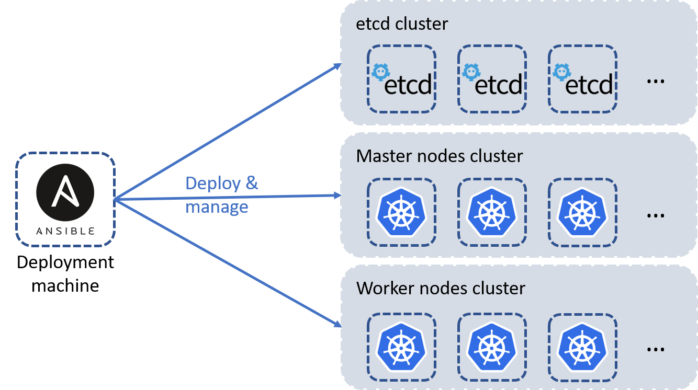

# Table of Contents
This is a list of points that will be explained in this instructions file for the AgoraKube project :

- [High-level Architecture](#high-level-architecture)
- [Prerequisites](#prerequisites)
- [Nodes Setup](#nodes-setup)
- [K8S Cluster Configuration](#k8s-cluster-configuration)
- [Agorakube Parameters](#agorakube-parameters)
- [Kubernetes deployment](#kubernetes-deployment)


# High-level Architecture

Below a diagram of the high-level architecture deployed by AgoraKube :


**Notes :** This distibution is aimed to be customizable so you can choose : 
 - Where the **etcd** will be deployed (with the master or not) 
 - The number of **master** nodes to deploy (from 1 to many)
 - The number of **etcd** nodes to deploy (from 1 to many)
 - The number of **worker** nodes to deploy (from 1 to many)
 
 # Prerequisites

This section explains what are the prerequisites to install AgoraKube in your environment.

## OS

Below the OS currently supported on all the machines :
  - Ubuntu 18.04 (Bionic) - amd64
  - Centos 7 & 8 - amd64
  
## Node Sizing

Below the sizing prerequisites for all the nodes (master and worker) :
- 2 GB or more of RAM per machine
- 2 CPUs or more
- Full network connectivity between all machines in the cluster (public or private network is fine)
- Full internet access
- Unique hostname, MAC address, and product_uuid for every node. See here for more [details](https://kubernetes.io/docs/setup/production-environment/tools/kubeadm/install-kubeadm/#verify-the-mac-address-and-product-uuid-are-unique-for-every-node).
- Certain ports are open on your machines. See here for more [details](https://kubernetes.io/docs/setup/production-environment/tools/kubeadm/install-kubeadm/#check-required-ports).
- Swap disabled. You MUST disable swap in order for the kubelet to work properly.

Below the sizing prerequisites for the deployment machine :
- 2 GB or more of RAM
- 1 CPU or more
- Full network connectivity between all machines in the cluster (public or private network is fine)
- Full internet access

# Nodes Setup

This section explains how to setup notes before deploying Kubernetes Clusters with AgoraKube.

## Deployment node

The deployment node is an Ansible server which contains all Ansible roles and variables used to deploy and configure Kubernetes Clusters with AgoraKube distribution.

- Connect to the deployment node and run the following command :
```
bash <(curl -s https://raw.githubusercontent.com/ilkilab/agorakube/master/setup-deploy.sh)
```


## K8S nodes

The K8S nodes will host all the components needed for a Kubernetes cluster Control and Data planes.

The prerequisites are:
- SSH Server (like Openssh)
- Python2

You can run the following command to automatically install those packages :
```
bash <(curl -s https://raw.githubusercontent.com/ilkilab/agorakube/master/setup-hosts.sh)
```

# K8S Cluster Configuration

AgoraKube enables an easy way to deploy and manage customizable K8S clusters.

## Inventory file

The first file to modify is ["./hosts"](../hosts). This file contains all architecture information about your K8S Cluster.

**All K8S servers names must be filled in by their FQDN.**

The next Sample deploys K8S components in HA mode on 6 nodes (3 **etcd/masters** nodes and 3 **workers** nodes) :

```
[deploy]
k8s-7.novalocal ansible_connection=local

[masters]
k8s-1.novalocal  ansible_host=10.20.20.4
k8s-2.novalocal  ansible_host=10.20.20.5
k8s-3.novalocal  ansible_host=10.20.20.8
#deploy.novalocal ansible_connection=local ip=10.20.20.8
[etcd]
k8s-1.novalocal  ansible_host=10.20.20.4
k8s-2.novalocal  ansible_host=10.20.20.5
k8s-3.novalocal  ansible_host=10.20.20.8
#deploy.novalocal ansible_connection=local ip=10.20.20.8
[workers]
k8s-4.novalocal  ansible_host=10.20.20.9
k8s-5.novalocal  ansible_host=10.20.20.11
k8s-6.novalocal  ansible_host=10.20.20.10
#deploy.novalocal ansible_connection=local ip=10.20.20.8

[all:vars]
advertise_ip_masters=84.39.47.56

# SSH connection settings
ansible_ssh_extra_args='-o StrictHostKeyChecking=no'
ansible_user=cloud
ansible_ssh_private_key_file=/tmp/private.pem
```

The **deploy** section contains information about how to connect to the deployment machine.

The **etcd** section contains information about the etcd machine(s) instances.

The **masters** section contains information about the masters nodes (K8S Control Plane).

The **workers** section contains information about the workers nodes (K8S Data Plane).

The **all:vars** section contains information about how to connect to K8S nodes.


## Configuration file

The [../group_vars/all.yaml](../group_vars/all.yaml) file contains all configuration variables that you can customize to make your K8S Cluster fit your needs.

Sample file will deploy **containerd** as container runtime, **flannel** as CNI plugin and **coredns** as DNS service : 

```
---

# CERTIFICATES
cn_root_ca: ilkilabs
c: FR
st: Ile-De-France
l: Paris
expiry: 87600h


# Components version
etcd_release: v3.4.3
kubernetes_release: v1.17.1
delete_previous_k8s_install: False

# IPs-CIDR Configurations
cluster_cidr: 10.33.0.0/16
service_cluster_ip_range: 10.32.0.0/24
kubernetes_service: 10.32.0.1
cluster_dns_ip: 10.32.0.10
service_node_port_range: 30000-32767
kube_proxy_mode: ipvs
kube_proxy_ipvs_algotithm: rr


# Custom features
runtime: containerd
network_cni_plugin: flannel
flannel_iface: default
ingress_controller: traefik
dns_server_soft: coredns
populate_etc_hosts: yes
k8s_dashboard: true
update_certs: false
service_mesh: linkerd
linkerd_release: stable-2.6.0
install_helm: false
init_helm: false
install_kubeapps: false

# Calico
calico_mtu: 1440

# Security
encrypt_key_etcd: 1fJcKt6vBxMt+AkBanoaxFF2O6ytHIkETNgQWv4b/+Q=

# Data Directory
data_path: "/var/agorakube"
```

**Note :** You can also modify the IPs-CIDR if you want.

# Agorakube Parameters

Below  you can find all the parameters you can use in this file, section by section.

### Certificates section

This section is used to custom certificates information.

| Parameter | Description | Values |
| --- | --- | --- |
| `cn_root_ca` | Certificate authority name | <ul><li> **Depend on your deployment** </li><br/><li>  **ilkilabs** *(default)* </li></ul>|
| `c` | Country where the certificate is issued | <ul><li> **Depend on your deployment** </li><br/><li>  **FR** *(default)* </li></ul>|
| `st` | State where the certificate is issued | <ul><li> **Depend on your deployment** </li><br/><li>  **Ile-de-France** *(default)* </li></ul>|
| `l` | City where the certificate is issued | <ul><li> **Depend on your deployment** </li><br/><li>  **Paris** *(default)* </li></ul>|
| `expiry` | Certificate lifetime in hours | <ul><li> **Depend on your needs** </li><br/><li>  **87600h** *(default)* </li></ul>|

### Components version section

This section is used to custom the components version of your deployment.

| Parameter | Description | Values |
| --- | --- | --- |
| `etcd_release` | Version of etcd component | <ul><li> **3.3.X** or **3.4.X** </li><br/><li>  **3.4.3** *(default)* </li></ul>|
| `kubernetes_release` | Version of kubernetes components | <ul><li> **1.15.X**, **1.16.X** or **1.17.X** </li><br/><li>  **1.17.1** *(default)* </li></ul>|
| `delete_previous_k8s_install` | Deletion of previous installations of Kubernetes | <ul><li> **true** </li><br/><li>  **false** *(default)* </li></ul>|

### IPs-CIDR Configurations

This section is used to custom network configurations of your deployment.

**Note :** It will depend on the CNI plugin used.

| Parameter | Description | Values |
| --- | --- | --- |
| `cluster_cidr` | CIDR used for all pods deployed in your cluster | <ul><li> **Depend on your deployment** </li><br/><li>  **10.33.0.0/16** *(default)* </li></ul>|
| `service_cluster_ip_range` | CIDR used for all services deployed in your cluster | <ul><li> **Depend on your deployment** </li><br/><li>   **10.32.0.0/16** *(default)* </li></ul>|
| `kubernetes_service` | IP used for Kubernetes service of your cluster. **Must be** the first IP of your service CIDR ! | <ul><li> **Depend on your deployment** </li><br/><li>  **10.32.0.1** *(default)* </li></ul>|
| `cluster_dns_ip` | IP used for DNS services deployed in your cluster | <ul><li> **Depend on your deployment** </li><br/><li>  **10.32.0.10** *(default)* </li></ul>|
| `service_node_port_range` | Range of ports used for all NodePort services deployed in your cluster | <ul><li> **depend on your deployment** </li><br/><li>   **30000-32767** *(default)* </li></ul>|
| `kube_proxy_mode` | Configure kube-proxy mode | <ul><li> **ipvs (default)** </li><br/><li>   **iptables** </li><br/><li>   **userspace**</li></ul>|
| `kube_proxy_ipvs_algotithm` | Load Balancing algorithm for *IPVS Kube-proxy* mode | <ul><li> **rr** *(default - round-robin)*</li><br/><li>   **lc** (least connection) </li><br/><li>   **dh** *(destination hashing)* </li><br/><li>   **sh** *(source hashing)* </li><br/><li>   **sed** *(shortest expected delay)* </li><br/><li>   **nq** *(never queue)* </li></ul>|

### Custom features section

This section is used to defined all custom features of your deployment.

| Parameter | Description | Values |
| --- | --- | --- |
| `runtime` | Container runtime used in your deployment | <ul><li> **ContainerD** *(default)* </li><br/><li>  **Docker**  </li></ul>|
| `network_cni_plugin` | CNI plugin used in your deployment | <ul><li> **Calico** </li><br/><li>  **Flannel** *(default)* </li></ul>|
| `flannel_iface` | Indicate to Flannel the specific iface to be binded | <ul><li> **default** *(default - take the first iface)* </li><br/><li>  **Specific Iface**</li></ul>|
| `ingress_controller` | Ingress Controller used in your deployment | <ul><li> **Traefik** *(default)* </li><br/><li>  **HAProxy**  </li><br/><li>  **nginx**  </li><br/><li>  **none**  </li></ul>|
| `dns_server_soft` | DNS service used in your deployment | <ul><li> **CoreDNS** *(default)* </li></ul>|
| `label_workers` | Fixed the label *node-role.kubernetes.io/worker* to all workers in your cluster | <ul><li> **false** </li><br/><li>  **true** *(default)* </li></ul>|
| `populate_etc_hosts` | Populate */etc/hosts* file of all your nodes in the cluster | <ul><li> **no** </li><br/><li>  **yes** *(default)* </li></ul>|
| `k8s_dashboard` | Deploy Kubernetes dashboard in your cluster | <ul><li> **false** </li><br/><li>  **true** *(default)* </li></ul>|
| `update_certs` | Update all the certificates of your cluster | <ul><li> **false** *(default)* </li><br/><li>  **true** </li></ul>|
| `service_mesh` | Service mesh used in your cluster | <ul><li> **LinkerD** *(default)* </li><br/><li>  **none** </li></ul>|
| `linkerd_release` | Version of LinkerD used in your cluster | <ul><li> **stable-2.6.0** *(default)* </li><br/><li>  **none** </li></ul>|
| `install_helm` | Helm installation in your cluster | <ul><li> **false** *(default)* </li><br/><li>  **true** </li></ul>|
| `init_helm` | Initialization of Helm | <ul><li> **false** *(default)* </li><br/><li>  **true** </li></ul>|
| `install_kubeapps` | Installation of Kubeapps - **install_helm** and **init_helm** have to be **true** also. | <ul><li> **false** *(default)* </li><br/><li>  **true** </li></ul>|

### Other parameters sections

Parameters for Calico CNI plugin :

| Parameter | Description | Values |
| --- | --- | --- |
| `calico_mtu` | MTU size to used in your deployment | <ul><li> **Depend on your needs** </li><br/><li>  **1440** *(default)* </li></ul>|

Parameters for etcd security :

| Parameter | Description | Values |
| --- | --- | --- |
| `encrypt_key_etcd` | Encryption key to use for etcd datas | <ul><li> **Depend on your deployment** </li><br/><li>  **1fJcKt6vBxMt+AkBanoaxFF2O6ytHIkETNgQWv4b/+Q=** *(default)* </li></ul> |

Parameters for Agorakube datas storage :

| Parameter | Description | Values |
| --- | --- | --- |
| `data_path` | Path to Agorakube datas directory | <ul><li> **Depend on your deployment** </li><br/><li> **"/var/agorakube"** *(default)* </li></ul> |

Parameters for etcd data location, and backups

| Parameter | Description | Values |
| --- | --- | --- |
| `etcd_data_directory` | Directory to store etcd data on **etcd members** | <ul><li> **/var/lib/etcd/** (default) </li><br/></ul> |
| `custom_etcd_backup_dir` | Directory where etcd leader backups are stored on **deploy** node | <ul><li> **{{data_path}}/backups_etcd/** (default if not defined) </li><br/></ul> |
| `restoration_snapshot_file` | Path to the etcd snapshot on **deploy** node | <ul><li> **not defined** (default) </li><br/></ul> |


# Kubernetes deployment

Once all configuration files are set, run the following command to launch the Ansible playbook that will deploy the pre-configured Kubernetes cluster :

```
sudo ansible-playbook agorakube.yaml
```
